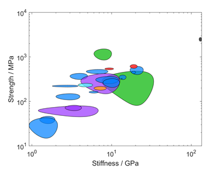

# AshbyPlots
MATLAB code for creating Ashby Plots with varying axes.

This was used as a part of my third-year literature review project on artificial spider silks.
It creates Ashby plots from collected data about different artificial silks in order to compare their properties based on the processing method used.

